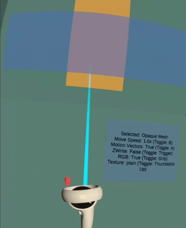
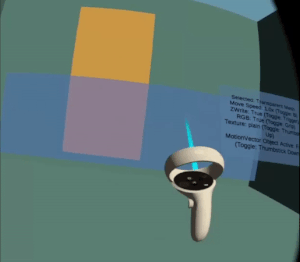
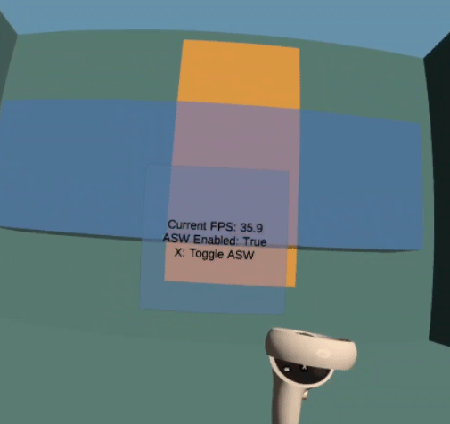

# App SpaceWarp

The App SpaceWarp demo for Unity was built to demonstrate how developers can consume [Unity's Application SpaceWarp API](https://developer.oculus.com/documentation/unity/unity-asw/), and how to diagnose and fix common issues with ASW-enabled apps.

Application SpaceWarp allows developers to generate only every other frame for their application, effectively allowing them to render at half framerate (i.e. 36fps for an app that renders at 72fps). The Oculus OS will then render a generated frame, which considers both per-pixel motion and head movement. This gives developers more time to generate better graphics and simulations in their application.

This codebase is available both as a reference and as a template for ASW-enabled apps. The [Oculus License](LICENSE) applies to the SDK and supporting material. The MIT License applies to only certain, clearly marked documents. If an individual file does not indicate which license it is subject to, then the Oculus License applies.

The *Oculus Integration* package is released under the *[Oculus SDK License Agreement](./Assets/Oculus/LICENSE.txt)*.

See the [CONTRIBUTING](CONTRIBUTING.md) file for how to help out.

## Getting started

First, ensure you have Git LFS installed by running this command:
```sh
git lfs install
```

Then, clone this repo using the "Code" button above, or this command:
```sh
git clone https://github.com/oculus-samples/Unity-AppSpaceWarp.git
```

To run the demo, clone this repo and open it in *Unity 2021.3.1f1* or higher. (Note that, due to a [known issue](https://developer.oculus.com/documentation/unity/unity-asw/), this demo will not work in Unity 2021.3.4 or 2021.3.5.) Load the [Assets/Scenes/Unity-AppSpaceWarp](Assets/Scenes/Unity-AppSpaceWarp.unity) scene.

Open the File > Build Settings window, click the "Android" platform in the menu that appears, and click the "Switch Platform" button. After Unity finishes re-importing, click the "Build And Run" button.

## App SpaceWarp in Action

Let's have a look at the App SpaceWarp demo in action.

The demo scene consists of 4 interactive elements: a baton attached to the left controller, a spinning semi-transparent mesh, a spinning opaque mesh, and a background.

With your left hand, you can press 'X' to toggle App SpaceWarp. A UI panel next to your left hand shows you the toggle status of App SpaceWarp in the demo, and the demo's current framerate.

With your right hand, you can point to any interactive element, and press the following buttons. Note that some of these interactions are disabled on certain objects, if they don't cause an interesting difference in the final render. Note that you can point at the baton in your left hand!
+ **A**: Toggle whether this object renders motion vectors.
+ **B**: Toggle the speed at which this object moves.
+ **Right Trigger**: Toggle whether this object writes to the depth buffer. *(Note this may make the object disappear. Its physics representation still exists, so you can point at where it should be and toggle Z-write again to make it re-appear.)*
+ **Right Grip**: Toggle whether this object writes to the RGB frame. *(Note this will make the object disappear. Its physics representation still exists, so you can point at where it should be and toggle RGB-write again to make it re-appear.)*
+ **Right Thumbstick Up**: Toggle the texture for this object. A noisy texture is provided to show ASW artifacts in scenes with high-frequency detail.
+ **Right Thumbstick Down**: Toggle whether an associated object is enabled. This is only used to toggle a MotionVector-frame-writing version of the transparent object, as transparent objects normally can't write motion vectors.

## Common Issues With App SpaceWarp

*Note: All animations below are presented at half speed, for clearer visibility of artifacts*

### Visually Identifying Spacewarped Objects

<div style="margin: auto; width: 60%; padding: 10pt;">
<table>
<tr>
	<td style="border:0px;"></td>
	<td style="border:0px;"><i>A mesh moving back and forth, not rendering motion vectors.</i></td>
</tr>
<tr>
	<td style="border:0px;"></td>
	<td style="border:0px;"><i>A mesh moving back and forth, correctly rendering motion vectors.</i></td>
</tr>
</table>
</div>

One of the most common issues we at Meta have seen with apps using App SpaceWarp is that some objects in a scene won't render motion vectors correctly. This usually happens because objects are using materials whose shaders haven't been modified to include a "MotionVector" pass. As a result, the App SpaceWarp algorithm thinks these objects aren't moving, and they will stay in the same screen-space location in generated frames. 

These objects are easy to identify to a trained eye, because they don't appear to move in generated frames (which makes them stutter in motion), and they don't have artifacts around the edges of their movement.

### Artifacts with fast motion

<div style="margin: auto; width: 60%; padding: 10pt;">
<table>
<tr>
	<td style="border:0px;"></td>
	<td style="border:0px;"><i>A mesh moving slowly, with ASW enabled.</i></td>
</tr>
<tr>
	<td style="border:0px;"></td>
	<td style="border:0px;"><i>A mesh moving quickly, with ASW enabled.</i></td>
</tr>
</table>
</div>

App SpaceWarp generates a frame by moving elements from the previous frame, per-pixel, based on the previous frame's motion vectors. This algorithm can create holes in the generated frame, in places where objects have moved away, and nothing has moved to take its place. Generally, the faster an object moves, the greater the hole left behind by it in a generated frame.

These holes are filled in by the App SpaceWarp algorithm by using the colors and patterns of neighboring pixels, but it cannot perfectly reconstruct the environment where a hole exists, leading to visual artifacts.

To reduce the visual impact of these artifacts, put caps on object velocity when using App Spacewarp, or turn off motion vectors on objects once they reach a certain velocity.

### Artifacts with noisy textures

<div style="margin: auto; width: 60%; padding: 10pt;">
<table>
<tr>
	<td style="border:0px;"></td>
	<td style="border:0px;"><i>A mesh moving against a plain background, with ASW enabled.</i></td>
</tr>
<tr>
	<td style="border:0px;"></td>
	<td style="border:0px;"><i>A mesh moving at the same speed against a noisy background, with ASW enabled.</i></td>
</tr>
</table>
</div>

The hole-filling algorithm used by App SpaceWarp creates less noticable artifacts if the neighboring pixels don't contain high-frequency detail. Apps using a less-detailed art style will be able to use App SpaceWarp with fewer concerns.

## Difficult Issues With App SpaceWarp

### Transparent objects in-world

<div style="margin: auto; width: 60%; padding: 10pt;">
<table>
<tr>
	<td style="border:0px;"></td>
	<td style="border:0px;"><i>A transparent mesh moving in front of an opaque mesh. Only the opaque mesh writes motion vectors.</i></td>
</tr>
<tr>
	<td style="border:0px;"></td>
	<td style="border:0px;"><i>A transparent mesh moving in front of an opaque mesh. Both meshes write motion vectors.</i></td>
</tr>
</table>
</div>

In-world transparent objects, such as windows, are a difficult case for App SpaceWarp. The App SpaceWarp algorithm only allows a given pixel to move in one direction, but the human brain might expect a transparent object and an overlapping opaque object to move in 2 different directions.

In the case of an opaque object and an overlapping transparent object moving in 2 different directions, you have to decide case-by-case which object is the player's focus, and have that object render motion vectors. The other object will generate artifacts, as the App SpaceWarp-generated frame will push the object in an incorrect direction before the next (app-rendered) frame snaps it back into place.

### Z-write on transparent objects in-world

<div style="margin: auto; width: 60%; padding: 10pt;">
<table>
<tr>
	<td style="border:0px;"></td>
	<td style="border:0px;"><i>A transparent mesh moving in front of an opaque mesh. Both meshes have ZWrite disabled and do not produce motion vectors. <b>Note:</b> disabling ZWrite using the trigger as set up in this sample will not result in this image, this was done by disabling ZWrite only in the motion vector shader pass.  </i></td>
</tr>
<tr>
	<td style="border:0px;"></td>
	<td style="border:0px;"><i>A transparent mesh moving in front of an opaque mesh. Both meshes have ZWrite enabled, only the opaque mesh produces motion vectors.</i></td>
</tr>
</table>
</div>

ZWrite is a shader setting which controls whether an object renders to the depth buffer for occlusion related calculations. For the purposes of App SpaceWarp ZWrite being enabled is required for motion vectors to be generated, but will only enable motion vectors for opaque objects (the reasons for this are discussed in the <i>Transparent objects in-world</i> section).

In the top image ZWrite is disabled on both objects meaning that neither produces motion vectors and App SpaceWarp is misled into believing that there is no movement, effectively resulting in a 36 fps scene with additional computational overhead. In the second image, ZWrite is enabled on both objects, but since motion vectors are not forcibly enabled on the transparent object it is still not rendering them, causing the same scenario as the first image in <i>Transparent objects in-world</i>. In general there is no benefit to having ZWrite enabled on a transparent object in App SpaceWarp unless you forcibly enable motion vectors.

### Transparent objects out-of-world

<div style="margin: auto; width: 60%; padding: 10pt;">
<table>
<tr>
	<td style="border:0px;"></td>
	<td style="border:0px;"><i>The semi-transparent UI is rendered directly to the eyebuffer, and is affected by motion vectors.</i></td>
</tr>
<tr>
	<td style="border:0px;"></td>
	<td style="border:0px;"><i>The semi-transparent UI is rendered to a compositor layer, and is not affected by motion vectors.</i></td>
</tr>
</table>
</div>

Out-of-world transparent objects, such as menus, should not be affected by in-world motion vectors when assembling an App SpaceWarp-generated frame.

By putting UI elements in [Compositor Layers](https://developer.oculus.com/documentation/unity/unity-ovroverlay/), you can separate them entirely from your game frame, so they aren't affected by the App SpaceWarp algorithm. Note that this causes the UI elements to appear to update at half framerate (since their compositor layer isn't updated when assembling the App SpaceWarp-generated frame.)

Another possible implementation for semi-transparent UI in apps with ASW is to have an in-world object, whose bounds match the bounds of your UI elements, which renders motion vectors for your UI (similar to how *Transparent objects in-world* is implemented, above). Compositor layers do add per-frame overhead, so this is a more performant choice.

## Additional Considerations With App SpaceWarp

### Static objects in ASW-enabled apps

Since static objects can appear to move at different speeds (i.e. nearby telephone poles go by faster than far-off trees from the perspective of a moving car), unmoving objects that are marked as 'Static' in Unity must still generate motion vectors. This is automatically handled in Oculus' branch of Unity URP, which is used in this demo. The walls and floors of this environment are marked Static, and generate expected motion vectors.

### Additional project settings with ASW-enabled apps

This application also enables multiple settings for a better user experience. Toggles for all these settings can be found in `Project Settings > XR Plug-in Management > Oculus`.

+ **Phase Sync**: When enabled, the Quest will time its VBLANK interrupt (when it takes a new frame from your application to display on-screen) to occur at exactly the time it predicts your application will complete a frame. For applications with steady per-frame workloads, this will create on average a half-frame improvement in latency. See [documentation](https://developer.oculus.com/documentation/unity/enable-phase-sync/).
+ **Late Latching**: In many game engine architectures (including the default Unity and Unreal architectures), a frame will be processed on CPU at frame X, and processed on GPU at frame Y>X. If late latching is enabled, the player's transform at the beginning of frame Y will be written into a GPU buffer, allowing the scene to be rendered with that transform instead of the transform sent to GPU at frame X. This causes 1+ frame(s) of lower perceived latency from head movement. See [documentation](https://developer.oculus.com/blog/optimizing-vr-graphics-with-late-latching/).
+ **Symmetric Projection**: Causes left-eye and right-eye cameras to render with symmetric, translated projection matrices. This improves cacheability of the Quest's tiled rendering system, which generally reduces rendering time. **NOTE**: Due to a current known issue with symmetric projection and App Spacewarp, symmetric projection is disabled at this time.