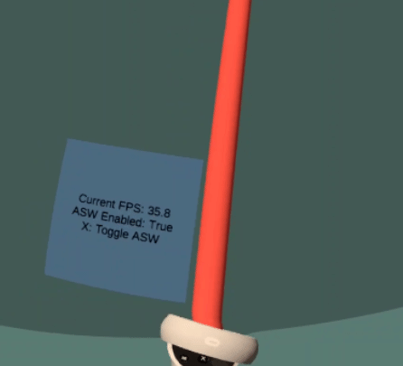
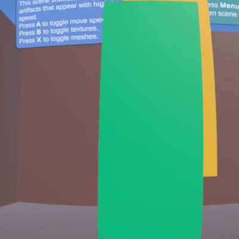
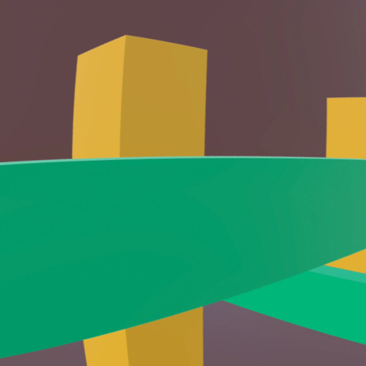
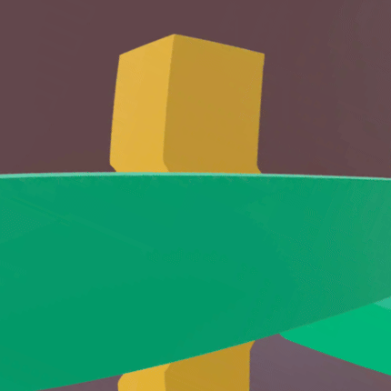
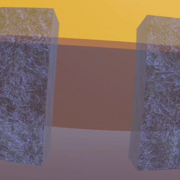
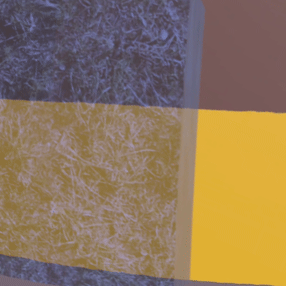
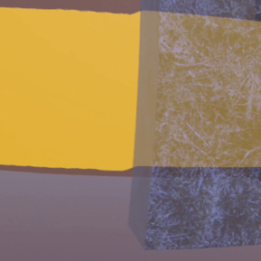

# App SpaceWarp

The App SpaceWarp demo for Unity was built to demonstrate how developers can consume [Unity's Application SpaceWarp API](https://developer.oculus.com/documentation/unity/unity-asw/), and how to diagnose and fix common issues with ASW-enabled apps.

Application SpaceWarp allows developers to generate only every other frame for their application, effectively allowing them to render at half framerate (i.e. 36fps for an app that renders at 72fps). The Oculus OS will then render a generated frame, which considers both per-pixel motion and head movement. This gives developers more time to generate better graphics and simulations in their application.

This codebase is available both as a reference and as a template for ASW-enabled apps. The [Oculus License](LICENSE) applies to the SDK and supporting material. The MIT License applies to only certain, clearly marked documents. If an individual file does not indicate which license it is subject to, then the Oculus License applies.

The *Oculus Integration* package is released under the *[Oculus SDK License Agreement](./Assets/Oculus/LICENSE.txt)*.

See the [CONTRIBUTING](CONTRIBUTING.md) file for how to help out.

## Getting started

First, ensure you have Git LFS installed by running this command:
```sh
git lfs install
```

Then, clone this repo using the "Code" button above, or this command:
```sh
git clone https://github.com/oculus-samples/Unity-AppSpaceWarp.git
```

To run the demo, clone this repo and open it in *Unity 2021.3.261f1* or higher. Load the [Assets/Scenes/OpaqueObjects](Assets/Scenes/OpaqueObjects.unity) scene.

Open the File > Build Settings window, click the "Android" platform in the menu that appears, and click the "Switch Platform" button. After Unity finishes re-importing, click the "Build And Run" button.

## App SpaceWarp in Action

Let's have a look at the App SpaceWarp demo in action.

This project consists of 4 scenes. Each scene is meant to demonstrate a different common source of artifacts caused by App SpaceWarp, and how to best mitigate them.

At any point while running the App SpaceWarp demo, you can press the menu button (☰) to open the Scene Select menu. There, you can change scenes, toggle App SpaceWarp, or render batons coming out of your controllers (which allow you to manually test App SpaceWarp interactions).

The following sections showcase App SpaceWarp-generated artifacts in each scene. We recommend examining these scenes while switching between normal gameplay and motion vector overlay debug-draw, as discussed in [App SpaceWarp developer documentation](https://developer.oculus.com/resources/os-app-spacewarp/#troubleshooting), to get a sense of what is being rendered in the MotionVector pass.

## Opaque Objects

*Note: Unless otherwise mentioned, all following animations are presented at half speed, for clearer visibility*

<div style="margin: auto; width: 60%; padding: 10pt;">
<table>
<tr>
	<td style="border:0px;"></td>
	<td style="border:0px;"><i>A scene rendered at full-framerate, without App SpaceWarp.</i></td>
</tr>
<tr>
	<td style="border:0px;"></td>
	<td style="border:0px;"><i>The same scene rendered at half-framerate, with App SpaceWarp generating in-between frames.</i></td>
</tr>
</table>
</div>

As discussed in [developer documentation](https://developer.oculus.com/resources/os-app-spacewarp/#tech-overview), App SpaceWarp works by using the most recent app-generated frame's eye, motion vector, and depth buffers to generate a new frame. This frame is generated by moving elements from the previous (app-generated) frame, per-pixel, based on the previous frame's motion vectors.

Once every pixel in the previous frame is moved according to its motion vectors, it is possible there will be "holes" left in the generated frame. These holes generally come from background elements, which were occluded in your app's submitted frame, but are now disoccluded in the App SpaceWarp-generated frame (because the occluding object has moved away). There is no information on how to render the newly-disoccluded pixels.

App SpaceWarp solves this issue by _stretching nearby background pixels over the holes_. This creates a "shimmer"/"halo" effect around the silhouette of the foreground object whose movement is causing disocclusion. This causes the majority of App SpaceWarp-related artifacts in correct implementations.

By understanding this behavior, you can understand knock-on effects that amplify the appearance of App SpaceWarp-related artifacts:

<div style="margin: auto; width: 60%; padding: 10pt;">
<table>
<tr>
	<td style="border:0px;"></td>
	<td style="border:0px;"><i>Art styles that contain lots of high-frequency detail cause stretched background pixels to be more noticable.</i></td>
</tr>
<tr>
	<td style="border:0px;"></td>
	<td style="border:0px;"><i>The faster a foreground object moves, the more pixels get disoccluded per frame, creating more noticable artifacts.</i></td>
</tr>
<tr>
	<td style="border:0px;"></td>
	<td style="border:0px;"><i>Objects with more complex silhouettes will disocclude more background pixels as they move, causing artifacts.</i></td>
</tr>
</table>
</div>

To reduce the visual impact of these artifacts, put caps on object velocity when using App Spacewarp, or turn off motion vectors on objects once they reach a certain velocity. Additionally, consider using art styles that avoid high-frequency detail in textures, or objects with complex silhouettes.

## Railings


This scene showcases a "surprise" artifact that comes with App SpaceWarp. When players move parallel with a long railing / wire, or when it moves towards them, it can appear to "not be moving" while generating artifacts like the ones discussed in [Opaque Objects](#opaque-objects). 

Motion vector debug-view makes it obvious what is happening: although there is no apparent movement, the App SpaceWarp algorithm is still correctly calculating motion vectors, and translating pixels in generated frames to match.

Note that there is no new disocclusion in generated frames in this scene. The artifacts here are not a result of hole-filling. Rather, they are a result of the motion vector buffer being smaller than the RGB eye buffer, causing motion to "blur" at discontinuities.

<div style="margin: auto; width: 60%; padding: 10pt;">
<table>
<tr>
	<td style="border:0px;"></td>
	<td style="border:0px;"><i>Without App SpaceWarp enabled, all frames of this scene of a green rail moving along its longest axis appear like this.</i></td>
</tr>
<tr>
	<td style="border:0px;"></td>
	<td style="border:0px;"><i>With App SpaceWarp enabled, artifacts will appear along the rail's perimeter, even though it doesn't appear to move.</i></td>
</tr>
</table>
</div>

## Transparent Objects

Application SpaceWarp does not support transparent objects. Its algorithm, which moves the input frame's pixels by an amount sampled from a per-pixel motion vector texture, assumes that each pixel moves in one direction. Transparency breaks that assumption: if a transparent blue object sits in front of a moving yellow object, the human brain expects the "blue part" of the pixel to stay still, and the "yellow part" of the pixel to move.

Of course, many applications use transparency, and Meta allows applications that use both transparency and Application SpaceWarp on the store. This scene shows the artifacts associated with implementations of transparency.

<div style="margin: auto; width: 60%; padding: 10pt;">
<table>
<tr>
	<td style="border:0px;"></td>
	<td style="border:0px;"><i>An opaque cube moving behind two transparent boxes, with App SpaceWarp disabled. There are no rendering artifacts.</i></td>
</tr>
<tr>
	<td style="border:0px;"></td>
	<td style="border:0px;"><i>This transparent box does not render motion vectors. The opaque cube renders correctly, but the transparent object is "pulled" in the direction of motion where the opaque object passes through.</i></td>
</tr>
<tr>
	<td style="border:0px;"></td>
	<td style="border:0px;"><i>This transparent box renders motion vectors. It renders correctly, but the intersecting part of the opaque object is "pulled" in the direction of its motion. Since the box is unmoving, the intersecting part appears to only move every other frame.</i></td>
</tr>
</table>
</div>

We recommend transparent objects render motion vectors if they're the focus of a user's attention. For instance, a fireball projectile is meant to grab a user's attention, and should render motion vectors. A passive smoke animation is not meant to grab a user's attention, and should not. 

## User Interfaces

By default, Unity renders its user interfaces -- even opaque user interfaces -- in a similar manner to transparent objects. Because of this, when App SpaceWarp is enabled, user interfaces will appear "pulled" in the direction of motion of opaque objects passing behind them, for the reasons discussed in [Transparent Objects](#transparent-objects).

Since user interfaces are almost always the focus of a user's attention, removing these artifacts is very important. There are two useful methods for removing these artifacts:

1. **Rendering motion vectors for the user interface**. This is the same behavior as discussed in [Transparent Objects](#transparent-objects), but it can be made more difficult, as you will need a 3D object (or multiple overlapping objects) whose bounds match the bounds of the UI.
2. **Compositor Layers**. Compositor layers are rendered separately from the main scene, and composited in later -- see [documentation](https://developer.oculus.com/resources/os-compositor-layers/). This allows UI to appear more "crisp", and, as a side effect, causes the elements rendered as a compositor layer to not be affected by App SpaceWarp. If your UI is meant to be an overlay on your scene (i.e. subtitles), this is an easy win. However, if your UI is meant to sit within your scene (i.e. controllers appear in front of it), you must render "poke-a-hole" zero-alpha pixels where your UI should appear, and those "poke-a-hole" pixels are affected by App SpaceWarp.

## Additional Considerations With App SpaceWarp

### Moving objects appearing to stutter

Transparent objects that appear to stutter are an expected behavior, and are discussed in the [Transparent Objects](#transparent-objects) section.

Opaque objects appear to stutter if they are using a material whose shaders haven't been modified to include a MotionVector pass. As a result, the App SpaceWarp algorithm thinks they aren't moving, causing them to generate the same artifacts discussed in the [Transparent Objects](#transparent-objects) section.

By capturing a frame of a scene that reproduces this behavior and analyzing with [RenderDoc](https://developer.oculus.com/downloads/package/renderdoc-oculus), you can see if a given opaque object is rendering during the MotionVector pass as expected.

### Static objects in ASW-enabled apps

Since static objects can appear to move at different speeds (i.e. nearby telephone poles go by faster than far-off trees from the perspective of a moving car), unmoving objects that are marked as 'Static' in Unity must still generate motion vectors. This is automatically handled in Oculus' branch of Unity URP, which is used in this demo. The walls and floors of this environment are marked Static, and generate expected motion vectors.

### Additional project settings with ASW-enabled apps

This application also enables multiple settings for a better user experience. Toggles for all these settings can be found in `Project Settings > XR Plug-in Management > Oculus`.

+ **Phase Sync**: When enabled, the Quest will time its VBLANK interrupt (when it takes a new frame from your application to display on-screen) to occur at exactly the time it predicts your application will complete a frame. For applications with steady per-frame workloads, this will create on average a half-frame improvement in latency. See [documentation](https://developer.oculus.com/documentation/unity/enable-phase-sync/).
+ **Late Latching**: In many game engine architectures (including the default Unity and Unreal architectures), a frame will be processed on CPU at frame X, and processed on GPU at frame Y>X. If late latching is enabled, the player's transform at the beginning of frame Y will be written into a GPU buffer, allowing the scene to be rendered with that transform instead of the transform sent to GPU at frame X. This causes 1+ frame(s) of lower perceived latency from head movement. See [documentation](https://developer.oculus.com/blog/optimizing-vr-graphics-with-late-latching/).
+ **Symmetric Projection**: Causes left-eye and right-eye cameras to render with symmetric, translated projection matrices. This improves cacheability of the Quest's tiled rendering system, which generally reduces rendering time. **NOTE**: Due to a current known issue with symmetric projection and App Spacewarp, symmetric projection is disabled at this time.